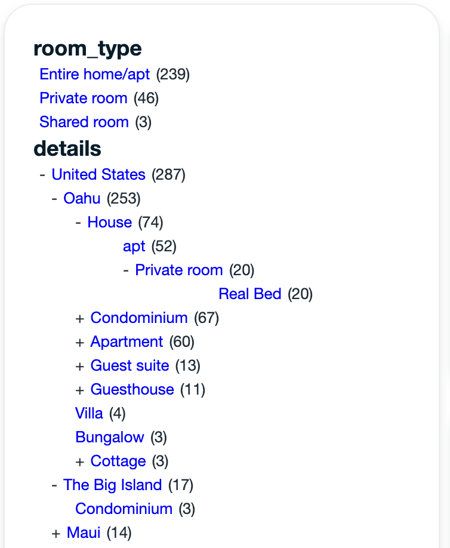

# What is this?
This repository contains sample code to implement 'nested facets' in MongoDB Atlas Search.

Video demo:

## What are 'nested facets'?
Simply put they are hiearcharchical filters that allow you to navigate structured relationships in your search queries. Here's a picture using the `sample_airbnb.listingsAndReviews` [sample data](https://www.mongodb.com/docs/atlas/sample-data/) that comes with your MongoDB Atlas installation.



## How do nested facets work?
This implementation of nested facets relies on having a specific data structure that allows faceting on child values and maintaing those values to their parents. Here is an example of a document with values from the example above:

```
{
    _id:"7660936",
    details:{
        level0:"United States"
        level1:"United States/Oahu"
        level2:"United States/Oahu/House"
        level3:"United States/Oahu/House/Private room"
        level4:"United States/Oahu/House/Private room/Real Bed"
    },
    ...
}
```

Then this field is indexed in Atlas Search as:

```
"details": {
    "dynamic": false,
    "fields": {
        "level0": [
        {
            "type": "stringFacet"
        },
        {
            "type": "token"
        }
        ],
        "level1": [
        {
            "type": "stringFacet"
        },
        {
            "type": "token"
        }
        ],
        "level2": [
        {
            "type": "stringFacet"
        },
        {
            "type": "token"
        }
        ],
        "level3": [
        {
            "type": "stringFacet"
        },
        {
            "type": "token"
        }
        ],
        "level4": [
        {
            "type": "stringFacet"
        },
        {
            "type": "token"
        }
        ]
    },
    "type": "document"
    },
```

For full example outputs and aggregation pipeline see [this example](EXAMPLE.MD)

# How does this app work?
This app allows you to use any existing database and collection to automatically create the appropriate structure. The app also writes the aggregation pipeline that you need based on the levels of nesting you want.

The app also provides front end components that allow you to render the facets and then use them to filter your search query.

## Running the app
You will need:
* Access to a MongoDB Atlas cluster
* NodeJS installed

## Setup
Set your environment variables. Simply copy the [example.env](example.env) file and rename it to `.env` and then make your changes.

You may also need to change your [schema values](https://github.com/JohnGUnderwood/atlas-search-nested-facets/blob/main/pages/index.js#L14-L19) in the frontend to make the search results render correctly.

Run
```
npm install
```

Run the [setup.mjs](setup.mjs) script
```
node setup.mjs
```

This script will create the write index definition and add it your cluster. It also creates the write data model by running a `$merge` aggregation pipeline on your collection.

## Run the frontend
To run in developer mode simply execute
```
npm run dev
```

You will then be able to access the frontend at [http://localhost:3000](http://localhost:3000)


